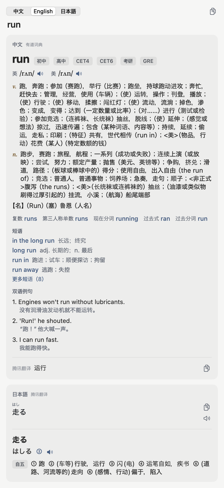
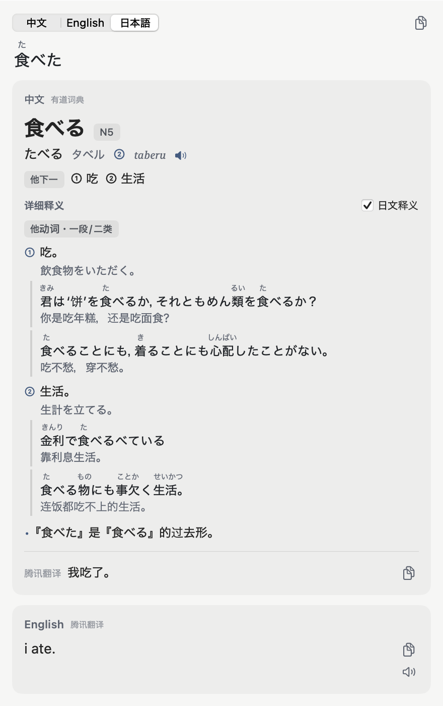
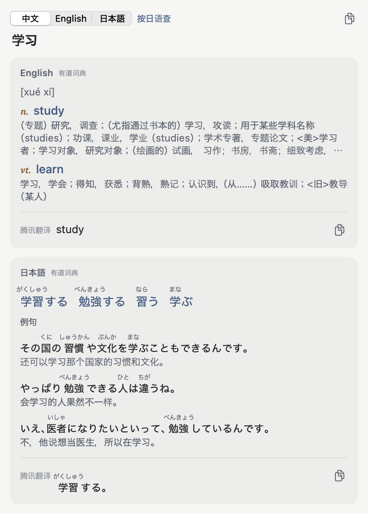
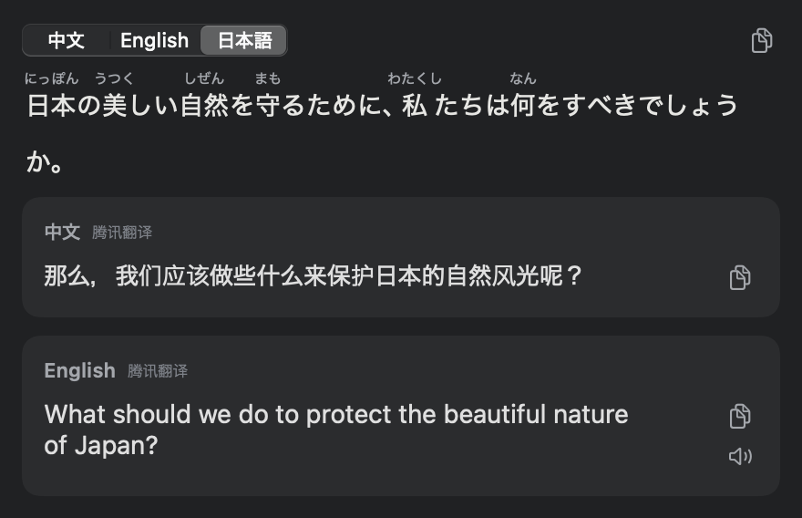

# mac-trilingual-dict · 日英学习辞典

一个 macOS 菜单栏翻译 / 查词工具，面向**以中文为母语、学习日语和英语**的人。
选中、截图或输入任意一种语言，立刻得到另外两种语言的结果；单词给出辞典级释义（类似 MOJi 辞書），句子给出机器翻译，日文自动标注假名。

A macOS menu-bar dictionary & translator for **Chinese speakers learning Japanese and English**. Look up a word or sentence in any of Chinese / Japanese / English and get the other two, with dictionary-grade entries (IPA, word forms, kana, pitch accent, part of speech, JLPT level, furigana).

| 英语单词 | 日语单词 | 中文单词 | 句子 |
|---|---|---|---|
|  |  |  |  |

## 学习者友好的功能

- **日语词条**：活用形自动还原（食べた → 食べる）、平假名 / 片假名 / 罗马音、声调（②）、词性（他下一 / 他动词・一段）、JLPT 等级、中文释义 + 日文释义、带注音的例句、发音
- **英语词条**：英 / 美音标与发音、考试标签（CET4 / 考研 / GRE…）、按词性释义、词形变化（复数、过去式、分词…）、短语、双语例句
- **中文词条**：对应的英语词（可点击继续查）、日语词（带假名）与例句，方便从母语反查外语表达
- **假名注音**：所有日文原文与日文译文都自动标注假名，生词不用再切出去查读音
- **三语互译**：输入中文显示英、日；输入英文显示中、日；输入日文显示中、英
- **自动区分中文和日语**：中日共用汉字，会先看字形（简体字库独有的字判中文，日语字库独有的字和繁体字判日语），再综合词典、系统语言识别等信息判断；判错了可一键切换
- **三种入口**
  - `⌥A` 输入翻译窗
  - **划词翻译**：选中文字后旁边出现小图标，鼠标移上去即弹出翻译卡片（不抢焦点）
  - `⌥S` 截图 OCR 翻译（看日文漫画、游戏、网页图片时很方便）；`⌥D` 直接翻译当前选中文字
- 浅色 / 深色模式；快捷键、划词黑名单、翻译引擎均可在设置中修改

## 安装

支持 macOS 14 及以上，Apple 芯片与 Intel 通用。

1. 在 [Releases](../../releases) 下载最新的 `DictTranslator-x.y.z.zip`，解压后把 `DictTranslator.app` 拖到「应用程序」
2. **首次打开会提示「已损坏，无法打开」或「无法验证开发者」**——这是因为 App 没有付费的 Apple 开发者公证，并不是文件真的损坏。任选一种方式放行：
   - 打开 **系统设置 › 隐私与安全性**，滚到底部，点击 **「仍要打开」**，再确认一次；
   - 或在终端执行：
     ```bash
     xattr -dr com.apple.quarantine /Applications/DictTranslator.app
     ```
3. 按引导授予权限：
   - **辅助功能**：划词翻译、⌥D（读取其他 App 中选中的文字）
   - **屏幕与系统音频录制**：⌥S 截图翻译（授权后需重启 App）

### 从源码编译
需要 Xcode（Swift 5.10+）。
```bash
git clone https://github.com/FinnKyo/mac-trilingual-dict.git
cd mac-trilingual-dict
./build.sh            # 编译通用二进制、签名并安装到 /Applications
```
`build.sh` 会自动使用钥匙串里的 Apple Development / Developer ID 证书签名（重新编译后系统权限不会失效）；没有证书则使用临时签名，每次重新编译后需要重新授权辅助功能。

## 数据来源

| 用途 | 来源 |
|---|---|
| 单词释义（英汉、日汉、汉英、汉日） | 有道词典网页接口 |
| 句子翻译 | Google 翻译网页接口 → 腾讯交互翻译（TranSmart）→ macOS 系统离线翻译，依次兜底；Google 被限流时自动暂停 10 分钟 |
| 发音 | 有道词典 |
| 中 / 日语言识别（汉字文本） | 汉字字库归属 + 系统 NaturalLanguage + 有道词典收录 + Google 语言检测 |
| 日文注音 | 系统日语分词器（CFStringTokenizer） |
| 截图文字识别 | Vision |

系统离线翻译需要 macOS 26+，并在「系统设置 › 通用 › 语言与地区 › 翻译语言」下载中文、英语、日语语言包。

> **说明**：有道、Google、腾讯的接口均为其网页版使用的非公开接口，并非官方开放 API，可能随时变更或限流。本项目仅供个人学习使用，请遵守各服务的使用条款。

## 开发

```bash
swift test                                              # 解析、语言识别与网络接口测试
swift build && .build/debug/DictTranslator --render "食べた" out.png [--dark]   # 离屏渲染结果界面
.build/debug/DictTranslator --identify 语料.json         # 中日识别准确率评测（语料为 {"ja": [...], "zh": [...]}）
scripts/package.sh                                      # 生成 Release 用的 zip
```

主要目录：

```
Sources/DictTranslator/
  App/         菜单栏、快捷键、权限、设置项
  Core/        语言识别、词 / 句判定、查询状态（LookupViewModel）
  Services/    有道词典、Google / 腾讯 / 系统翻译、假名注音、OCR、发音
  Selection/   划词监听、选中文字读取、小图标与翻译卡片
  Screenshot/  截图翻译
  UI/          结果界面、词条视图、配色（Theme）、设置界面
```

## 许可证

[GPL-3.0](LICENSE)

第三方依赖：[KeyboardShortcuts](https://github.com/sindresorhus/KeyboardShortcuts)（MIT）。
