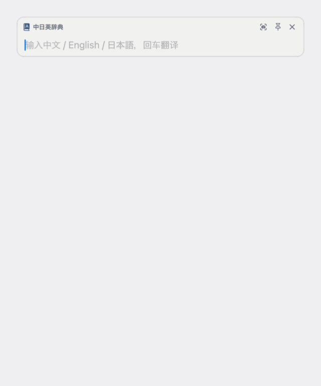
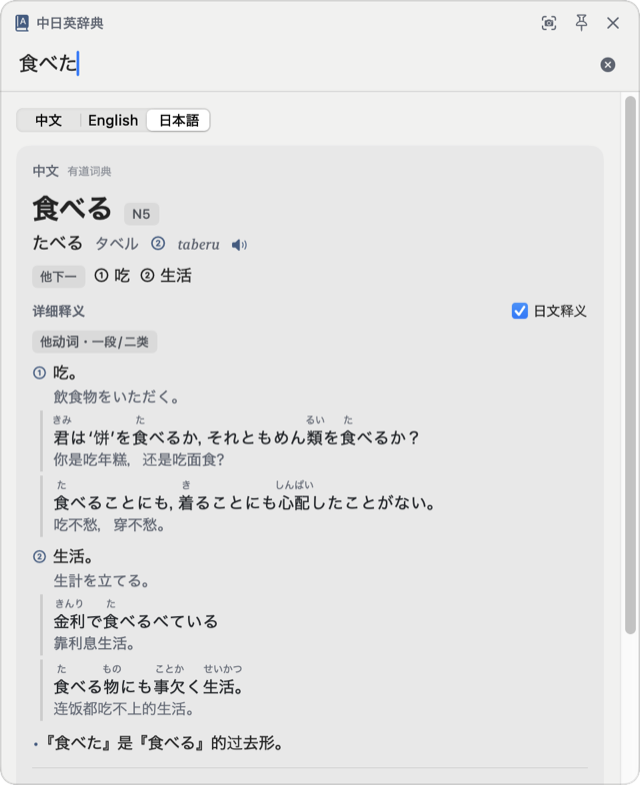
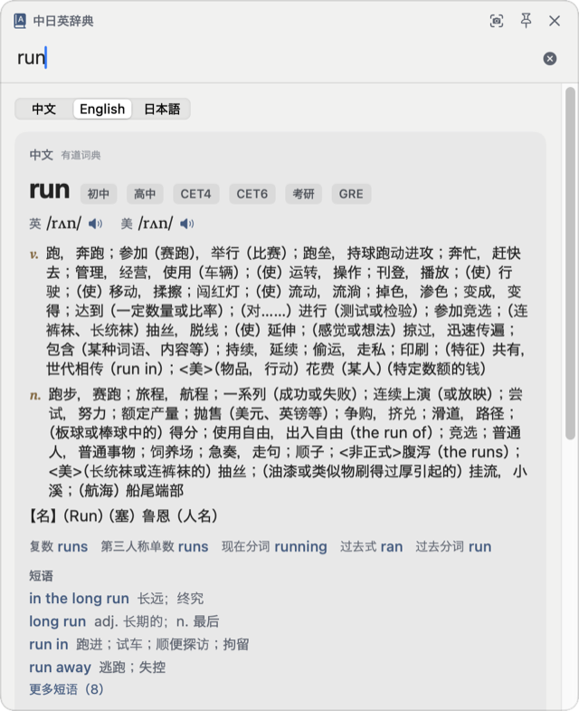
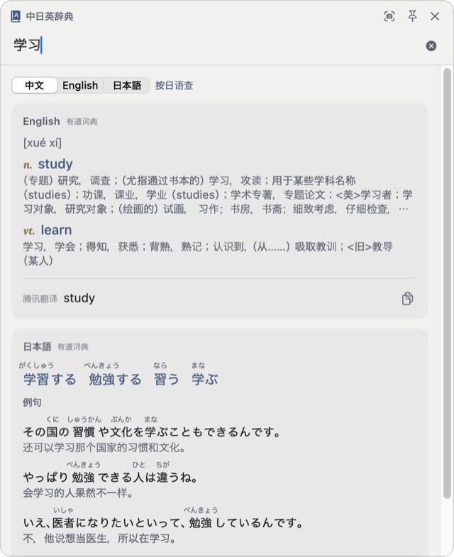
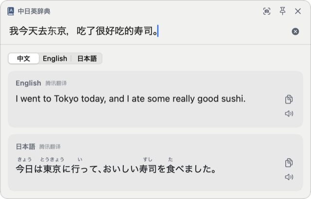

<h1 align="center">中日英辞典 · mac-trilingual-dict</h1>

<p align="center">
  面向<b>以中文为母语、学习日语和英语</b>的 macOS 菜单栏辞典与翻译工具<br>
  <sub>A menu-bar dictionary &amp; translator for Chinese speakers learning Japanese and English</sub>
</p>

<p align="center">
  <a href="../../releases/latest"></a>
  
  
  <a href="LICENSE"></a>
</p>

<p align="center">
  <picture>
    <source media="(prefers-color-scheme: dark)" srcset="docs/hero-dark.gif">
    
  </picture>
</p>

输入、划词或截图，任意一种语言进去，另外两种语言出来：
**单词给出辞典级释义**（读音、声调、词性、JLPT 等级、例句），**句子给出机器翻译**，日文自动标注假名，生词不用再切出去查读音。

## 能做什么

| 你在做什么 | 怎么用 |
|---|---|
| 读日语网页、文档，遇到不会的词 | 选中文字，鼠标移到旁边出现的小图标上，翻译就出来了 |
| 看日文漫画、游戏、图片里的字 | `⌥S` 框选屏幕区域，自动识别文字并翻译 |
| 想快速查一个词或一句话 | `⌥A` 打开输入窗，直接输入 |
| 已经选中了文字，想立刻翻译 | `⌥D` |

划词、截图、⌥D 的结果都显示在**同一个窗口**里，文字带进来后光标就在末尾，划到的内容不对（比如带进了多余的符号）可以直接改，回车重新查询。划词时窗口跟着选区走，其余入口固定在屏幕右上角。

## 截图

<table>
  <tr>
    <th align="center">日语单词</th>
    <th align="center">英语单词</th>
    <th align="center">中文反查</th>
    <th align="center">句子翻译</th>
  </tr>
  <tr>
    <td><picture><source media="(prefers-color-scheme: dark)" srcset="docs/shot-ja-dark.png"></picture></td>
    <td><picture><source media="(prefers-color-scheme: dark)" srcset="docs/shot-en-dark.png"></picture></td>
    <td><picture><source media="(prefers-color-scheme: dark)" srcset="docs/shot-zh-dark.png"></picture></td>
    <td><picture><source media="(prefers-color-scheme: dark)" srcset="docs/shot-sentence-dark.png"></picture></td>
  </tr>
</table>

## 功能

### 辞典
- **日语词条**：活用形自动还原（食べた → 食べる）、平假名 / 片假名 / 罗马音、声调（②）、词性（他下一 / 他动词・一段）、JLPT 等级、中文释义 + 日文释义、带注音的例句、发音
- **英语词条**：英 / 美音标与发音、考试标签（CET4 / 考研 / GRE…）、按词性释义、词形变化（复数、过去式、分词…）、短语、双语例句
- **中文词条**：对应的英语词（可点击继续查）、日语词（带假名）与例句，方便从母语反查外语表达
- 词条里的单词、词形、短语都可以**点击继续查**，支持返回

### 翻译
- **三语互译**：输入中文显示英、日；输入英文显示中、日；输入日文显示中、英
- **假名注音**：所有日文原文与日文译文都自动标注假名
- **句子翻译**按 Google → 腾讯交互翻译 → macOS 系统离线翻译依次兜底，Google 被限流时自动暂停，不会反复等待超时

### 自动区分中文和日语
中日共用汉字，「学校」「影響」光看字面分不清。这里分两层判断：
1. **看字形**：简体中文字库独有的字（们、这、习）判中文；日语字库独有的字（経、団、広）和繁体字判日语；有假名按假名占比判断。这一层有定论就直接用，不联网。
2. **全是通用字的词**（如「寿司」「手机」）再综合系统语言识别、有道词典收录情况、中文常用词表、JLPT 标记加权判断，没有结论就按中文。

判错了可以点「按日语查 / 按中文查」或顶部的语言切换一键改正。

### 其他
- 浅色 / 深色模式自动跟随系统
- 快捷键、划词图标消失时间、划词黑名单（默认不在终端、Xcode 等里弹出）、翻译引擎都可以在设置里改
- 支持登录时自动启动

## 安装

支持 macOS 14 及以上，Apple 芯片与 Intel 通用。

1. 在 [Releases](../../releases/latest) 下载最新的 `DictTranslator-x.y.z.zip`，解压后把 `DictTranslator.app` 拖到「应用程序」
2. **首次打开会提示「已损坏，无法打开」或「无法验证开发者」**——这是因为 App 没有付费的 Apple 开发者公证，并不是文件真的损坏。任选一种方式放行：
   - 打开 **系统设置 › 隐私与安全性**，滚到底部，点击 **「仍要打开」**，再确认一次；
   - 或在终端执行：
     ```bash
     xattr -dr com.apple.quarantine /Applications/DictTranslator.app
     ```
3. 按引导授予权限：
   - **辅助功能**：划词翻译、⌥D（读取其他 App 中选中的文字）
   - **屏幕与系统音频录制**：⌥S 截图翻译（授权后需重启 App）

### 常见问题

<details>
<summary>已经在系统设置里勾选了权限，App 里仍然显示「未授权」</summary>

更新或重新编译 App 后，系统可能认为它是一个新的程序。在「系统设置 › 隐私与安全性 › 辅助功能 / 屏幕与系统音频录制」里先把「中日英辞典」移除（点 −），再重新添加或重新勾选，然后重启 App。
</details>

<details>
<summary>划词后没有出现小图标</summary>

- 确认已授予「辅助功能」权限，且菜单栏图标菜单里「划词翻译」是勾选状态；
- 当前 App 可能在划词黑名单里（设置 › 划词），默认终端、Xcode、VS Code、访达在黑名单中；
- 小图标几秒后会自动消失，时间可以在设置里调整；
- 也可以直接选中文字后按 `⌥D`。
</details>

<details>
<summary>提示「查询失败」或句子没有翻译结果</summary>

词典和翻译用的是各服务网页版的非公开接口，网络不通或被限流时会失败，可以点结果里的「重试」。国内网络建议在设置里选「腾讯交互翻译优先」。系统离线翻译需要 macOS 26+，并在「系统设置 › 通用 › 语言与地区 › 翻译语言」下载中文、英语、日语语言包。
</details>

<details>
<summary>⌘C / ⌘V 在输入框里不能用</summary>

请更新到 v1.2.1 或更高版本。
</details>

## 从源码编译

需要 Xcode（Swift 5.10+）。

```bash
git clone https://github.com/FinnKyo/mac-trilingual-dict.git
cd mac-trilingual-dict
./build.sh            # 编译通用二进制、签名并安装到 /Applications
```

`build.sh` 会自动使用钥匙串里的 Apple Development / Developer ID 证书签名（重新编译后系统权限不会失效）；没有证书则使用临时签名，每次重新编译后需要重新授权辅助功能。只想编译不安装：`NO_INSTALL=1 ./build.sh`。

## 数据来源

| 用途 | 来源 |
|---|---|
| 单词释义（英汉、日汉、汉英、汉日） | 有道词典网页接口 |
| 句子翻译 | Google 翻译网页接口 → 腾讯交互翻译（TranSmart）→ macOS 系统离线翻译，依次兜底；Google 被限流时自动暂停 10 分钟 |
| 发音 | 有道词典 |
| 中 / 日语言识别（汉字文本） | 汉字字库归属 + 系统 NaturalLanguage + 有道词典收录 + Google 语言检测 |
| 日文注音 | 系统日语分词器（CFStringTokenizer） |
| 截图文字识别 | Vision |

> **说明**：有道、Google、腾讯的接口均为其网页版使用的非公开接口，并非官方开放 API，可能随时变更或限流。本项目仅供个人学习使用，请遵守各服务的使用条款。

## 开发

```bash
swift test                                              # 解析、语言识别与网络接口测试
swift build && .build/debug/DictTranslator --render "食べた" out.png [--dark]   # 离屏渲染结果界面
.build/debug/DictTranslator --identify 语料.json         # 中日识别准确率评测（语料为 {"ja": [...], "zh": [...]}）
scripts/package.sh                                      # 生成 Release 用的 zip
```

主要目录：

```
Sources/DictTranslator/
  App/         菜单栏、主菜单、快捷键、权限、设置项
  Core/        语言识别（LanguageDetector / LanguageIdentifier）、词 / 句判定、查询状态（LookupViewModel）
  Services/    有道词典、Google / 腾讯 / 系统翻译、假名注音、OCR、发音
  Selection/   划词监听、选中文字读取、小图标
  Screenshot/  截图翻译
  UI/          输入翻译窗、结果界面、词条视图、配色（Theme）、设置界面
```

`docs/` 里的演示图是用调试版 App 自己的窗口截图合成的，不是屏幕录制。

## 许可证

[GPL-3.0](LICENSE)

第三方依赖：[KeyboardShortcuts](https://github.com/sindresorhus/KeyboardShortcuts)（MIT）。
